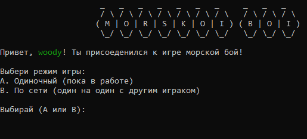
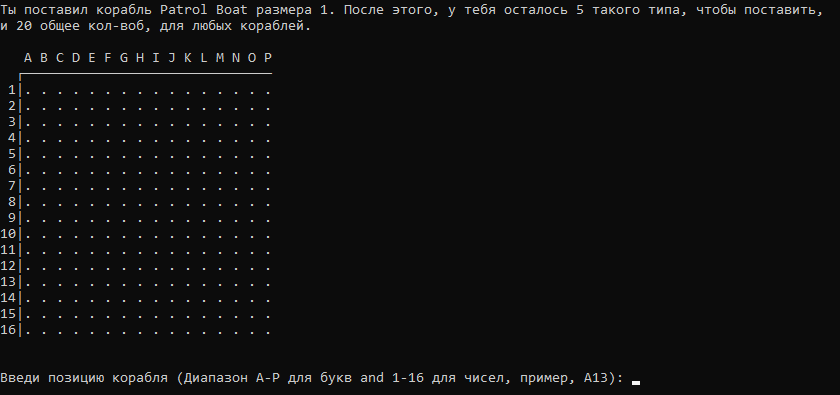
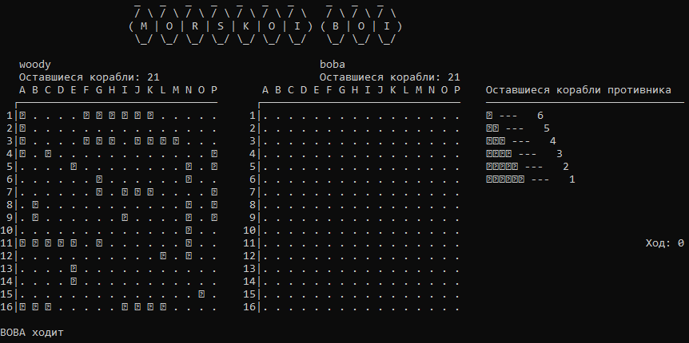
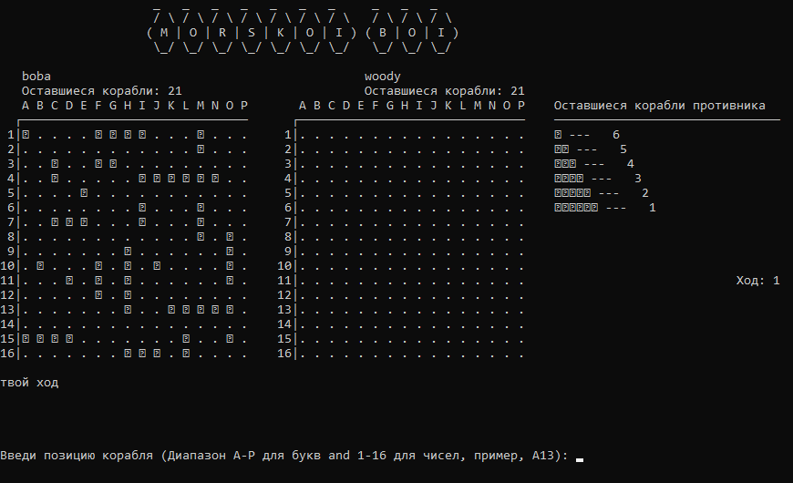
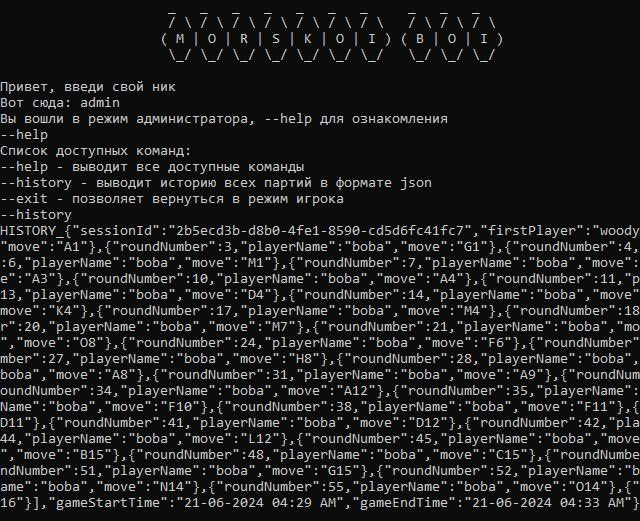
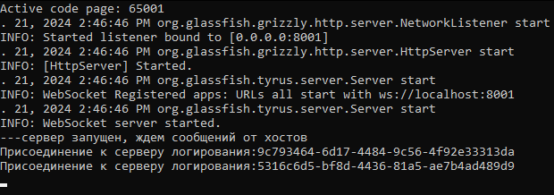

# Морской бой

## Описание игры

Игра ведется на сетке размером 16х16, где столбцы обозначены от А до Р, а строки - от 1 до 16. В распоряжении игроков есть
флот, состоящий из 6 типов кораблей размером от 1 до 6 ячеек.

В игре есть три режима: одиночная игра против бота(еще не сделано), многопользовательский режим с использованием websockets для взаимодействия в режиме реального времени и режим администратора для получения списка всех сыгранных игр в формате json.

В первых двух режимах игроки могут размещать свои корабли на сетке вручную или автоматически, следуя правилу
, согласно которому корабли не могут пересекаться или находиться рядом друг с другом.
Во время игры игроки по очереди угадывают координаты кораблей противника. Игра предоставляет обратную связь в
виде сообщений "попал", "потоплен" или "промахнулся". Если игрок промахивается, очередь переходит к противнику.

Основная цель - первым уничтожить все корабли противника. Каждый ход визуально представлен на
сетке, где крестик обозначает "промах", а крестик внутри прямоугольника - "попадание" или "потопление" корабля.

Третий режим активируется за счет ввода специального имени пользователя "admin" и предоставляет набор из трех команд (--help, --history, --exit).

## Установка

1. **Ссылка для клонирования**
    ```console  
    git clone https://github.com/WoodyGray/battleship.git
    ```
2. **Запуск приложений**

   For Windows systems:
   - for game execute `battleship_windows.bat`.
   - for logging server execute `logging_server.bat`.

## Как играть

Следуйте инструкциям на экране, чтобы начать играть в игру.



### Режимы игры

- В начале игры игроку предлагается ввести свое имя.
- Игра предлагает выбор между "одиночным режимом" и "многопользовательским режимом".
- При каждом ходе игры на поле игрока и поле противника отображаются метки попаданий, что очищает состояние консоли.
- Реализован автоматический режим заполнения поля кораблями.



### Многопользовательский режим
- В "многопользовательском режиме" игра синхронизирует действия и распределение ходов через websocket-соединение. Кроме того,
  в игровом режиме для подключения к существующему игроку указывается подключение к хосту.
- Второй игрок подключается, если первый игрок начал игру через websocket.
- Если игроки для игры уже найдены, все последующие подключения осуществляются в качестве "наблюдателей", которые не могут делать
  ходы, а могут только наблюдать за основной игрой.




### Режим администратора
- В начале игры в качестве имени пользователя можно ввести "admin", для входя в режим администратора
- Режим позволяет обратиться к серверу логирования и получить все сыгранные матчи из файлв logs.txt в формате json
- Присуцтуют три основные команды:
- - --help (для получения списка всех доступных команд админа) 
- - --history (для получения списка сыграных партий в формате json)
- - --exit (для возвращения в режим обычной игры)



### Сервер логирования
- На хосте в течении матча собирается экземпляр класса PlayedGame, который по завершению матча маппится в json и отправляется по websocket на сервер логирования
- Серсер использует порт 8001
- Когда на сервер приходит сообщение он просто записывает его в новую строку файлв logs.txt
- Когда на сервер приходит команда aдмина, он построчно отправляет ему содержимое файла logs.txt
- В информации о матче присуцтвует:
- - id сессии
- - имена игроков
- - поле "выйграл ли хост"
- - список ходов(номер, кто ходил, ход)
- - время начала партии и конца



### To-do
- [ ] Сделать игру с ботом.
- [ ] Улучшить режим наблюдателя, чтобы были видны все доски
- [ ] Расширить функциолльность режима админа
- [ ] Нормально обработать исключения
